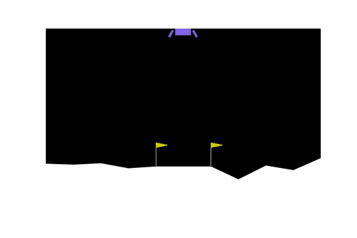

# lunarlander_gym


## Summary
This project is implementation of multiple AI agents based on different Reinforcement Learning methods  to OpenAI Gymnasium Lunar-Lander environment which is classic rocket landing trajectory optimization problem.


* Free software: MIT license
* Documentation: https://lunarlander-gym.readthedocs.io.

# Demo
|                   | RandomAgent | Gradient Policy Agent | Q-Learning Agent | Actor-critic Agent |
| ----------------- | ----------- | --------------------- | ---------------- | ------------------ |
| Training episodes | 0           | 10,000                | 3000             | 3000               |
| Reward            | -70.46      | 49.07                 | 198.51           | 284.86             |
|Output Models|[link](output/RandomAgent)|[link](output/VanillaPolicyGradientAgent)|[link](output/QLearningAget)|[link](output/ActorCriticAgent)|
|Demo|  |  |  |  |

## Installation


### From sources


The sources for lunarlander_gym can be downloaded from the `Github repo`_.

* Clone the repository

    ```
        $ git clone git://github.com/ehsan2754/lunarlander_gym
    ```


* Once you have a copy of the source, you can install it with:

    ```
        $ sudo apt update && sudo apt upgrade
        $ sudo apt install make
        $ pip install requirements_dev.txt
        $ make install

    ```
- Now you can just immidiately use it:

        
    ```
        $ lunarlander-gym -h
            usage: lunarlander_gym [-h] -m M

            options:
            -h, --help        show this help message and exit
            -m M, --method M  Specifies the Reinforcement Agent method { 0 -> Random, 1 ->
                                Gradient based optimization, 2 -> Q-Learning Agent 3 -> Actor-
                                critic }
    ```
    


