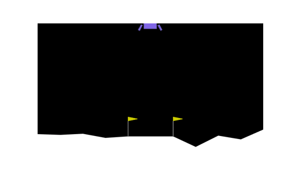
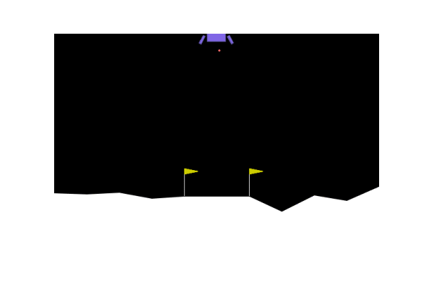

lunarlander_gym
===============

|https://pypi.python.org/pypi/lunarlander_gym|
|https://travis-ci.com/ehsan2754/lunarlander_gym|
|https://lunarlander-gym.readthedocs.io/en/latest/?version=latest|
|https://pyup.io/repos/github/ehsan2754/lunarlander_gym/|

Summary
-------

This project is implementation of multiple AI agents based on different
Reinforcement Learning methods to OpenAI Gymnasium Lunar-Lander
environment which is classic rocket landing trajectory optimization
problem.

-  Free software: MIT license
-  Documentation:
   `https://lunarlander-gym.readthedocs.io <https://lunarlander-gym.readthedocs.io>`__.

Demo
====

+-------------+-------------+-------------+-------------+-------------+
|             | RandomAgent | Gradient    | Q-Learning  | A           |
|             |             | Policy      | Agent       | ctor-critic |
|             |             | Agent       |             | Agent       |
+=============+=============+=============+=============+=============+
| Training    | 0           | 10,000      | 3000        | 3000        |
| episodes    |             |             |             |             |
+-------------+-------------+-------------+-------------+-------------+
| Reward      | -70.46      | 49.07       | 198.51      | 284.86      |
+-------------+-------------+-------------+-------------+-------------+
| Output      | `link <     | `link <outp | `link <ou   | `           |
| Models      | output/Rand | ut/VanillaP | tput/QLearn | link <outpu |
|             | omAgent>`__ | olicyGradie | ingAget>`__ | t/ActorCrit |
|             |             | ntAgent>`__ |             | icAgent>`__ |
+-------------+-------------+-------------+-------------+-------------+
| Demo        | |image12|   | |image13|   | |image14|   | |image15|   |
+-------------+-------------+-------------+-------------+-------------+

Installation
------------

From sources
~~~~~~~~~~~~

The sources for lunarlander_gym can be downloaded from the
``Github repo``\ \_.

-  Clone the repository

   ::

          $ git clone git://github.com/ehsan2754/lunarlander_gym

-  Once you have a copy of the source, you can install it with:

   ::

          $ sudo apt update && sudo apt upgrade
          $ sudo apt install make
          $ pip install -r requirements_dev.txt
          $ sudo make install

-  Now you can just immidiately use it:

   ::

          $ lunarlander-gym -h
              usage: lunarlander_gym [-h] -m M

              options:
              -h, --help        show this help message and exit
              -m M, --method M  Specifies the Reinforcement Agent method { 0 -> Random, 1 ->
                                  Gradient based optimization, 2 -> Q-Learning Agent 3 -> Actor-
                                  critic }

.. |https://pypi.python.org/pypi/lunarlander_gym| image:: https://img.shields.io/pypi/v/lunarlander_gym.svg
.. |https://travis-ci.com/ehsan2754/lunarlander_gym| image:: https://img.shields.io/travis/ehsan2754/lunarlander_gym.svg
.. |https://lunarlander-gym.readthedocs.io/en/latest/?version=latest| image:: https://readthedocs.org/projects/lunarlander-gym/badge/?version=latest
.. |https://pyup.io/repos/github/ehsan2754/lunarlander_gym/| image:: https://pyup.io/repos/github/ehsan2754/lunarlander_gym/shield.svg

.. |image10| image:: https://github.com/Ehsan2754/lunarlander_gym/blob/2d363ee2506ce47e22b6216e2091882e0ad7e172/output/QLearningAget/test_outputs/TestQLearningAgetEpisodes8Reward=198.51.gif
.. |image11| image:: https://github.com/Ehsan2754/lunarlander_gym/blob/2d363ee2506ce47e22b6216e2091882e0ad7e172/output/ActorCriticAgent/test_outputs/TestActorCriticAgentEpisodes12Reward=284.86.gif
.. |image12| image:: https://github.com/Ehsan2754/lunarlander_gym/blob/2d363ee2506ce47e22b6216e2091882e0ad7e172/output/RandomAgent/test_outputs/TestRandomAgentEpisodes8Reward=-69.36.gif
.. |image13| image:: https://github.com/Ehsan2754/lunarlander_gym/blob/2d363ee2506ce47e22b6216e2091882e0ad7e172/output/VanillaPolicyGradientAgent/test_outputs/TestVanillaPolicyGradientAgentEpisodes4Reward=49.07.gif
.. |image14| image:: https://github.com/Ehsan2754/lunarlander_gym/blob/2d363ee2506ce47e22b6216e2091882e0ad7e172/output/QLearningAget/test_outputs/TestQLearningAgetEpisodes8Reward=198.51.gif
.. |image15| image:: https://github.com/Ehsan2754/lunarlander_gym/blob/2d363ee2506ce47e22b6216e2091882e0ad7e172/output/ActorCriticAgent/test_outputs/TestActorCriticAgentEpisodes12Reward=284.86.gif